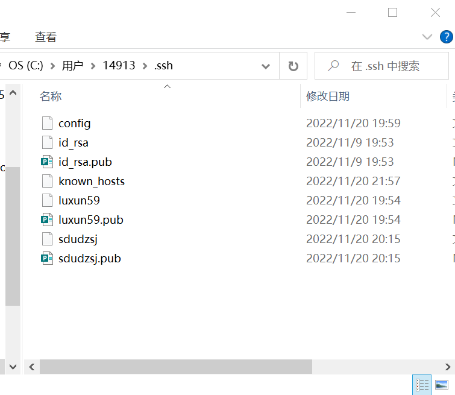
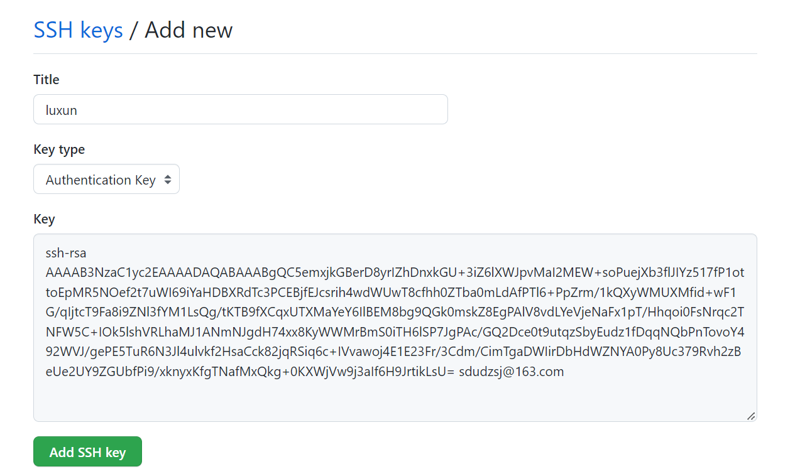
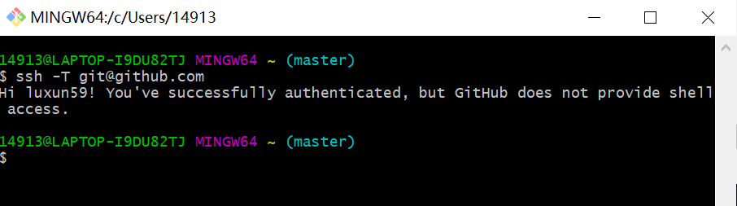
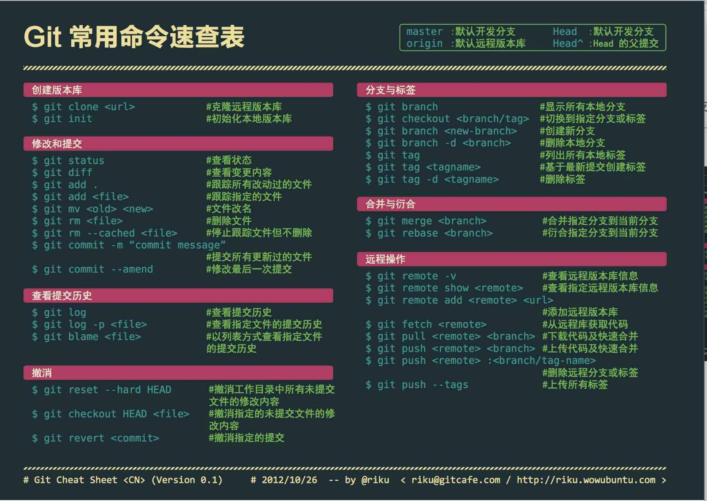
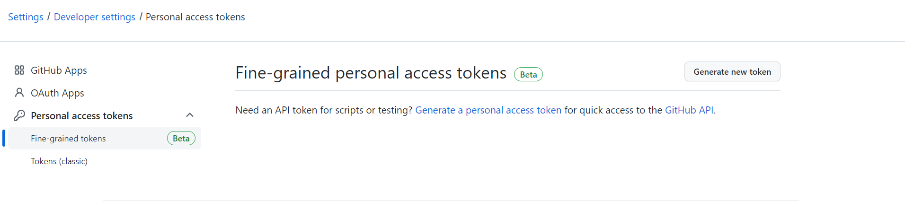
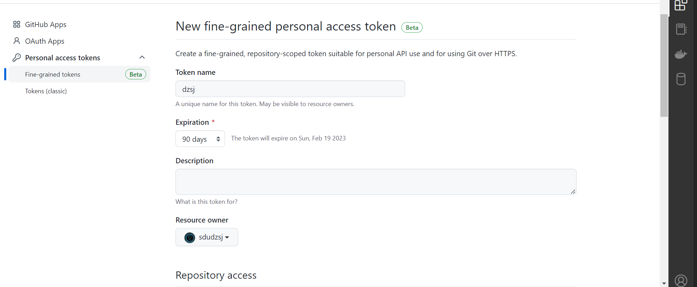
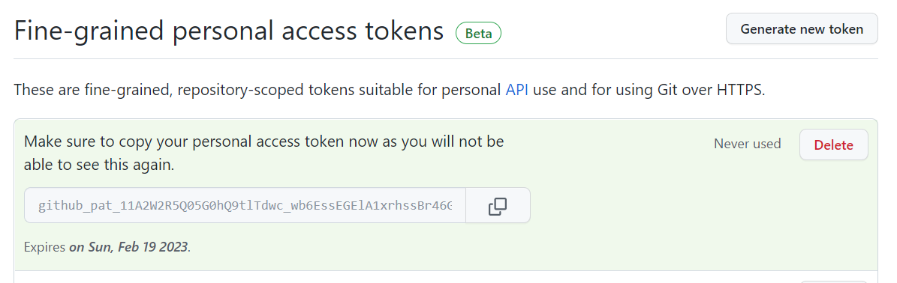

<!--
 * @Author: luxun59 luxun59@126.com
 * @Date: 2022-11-23 19:59:51
 * @LastEditors: luxun59 luxun59@126.com
 * @LastEditTime: 2022-11-30 11:46:47
 * @FilePath: \undefinedc:\Users\14913\Desktop\c2000\http\README.md
 * @Description: 
 * 
 * Copyright (c) 2022 by luxun59 luxun59@126.com, All Rights Reserved. 
-->

# Git Quick Start

- [Git Quick Start](#git-quick-start)
  - [基本知识](#基本知识)
    - [Git基本流程](#git基本流程)
    - [github(或gitee)上创建库](#github或gitee上创建库)
  - [首次使用](#首次使用)
    - [1.注册github（或gitee）账号，创建一个库](#1注册github或gitee账号创建一个库)
    - [2.安装git](#2安装git)
    - [3.git中设置用户名和邮箱](#3git中设置用户名和邮箱)
    - [4.身份验证](#4身份验证)
      - [a.通过 HTTPS 连接(官方文档推荐，安全系数高)](#a通过-https-连接官方文档推荐安全系数高)
      - [b.通过 SSH 连接(建议个人账号使用,较为方便，推荐新手使用 )](#b通过-ssh-连接建议个人账号使用较为方便推荐新手使用-)
    - [5.生成授权密码](#5生成授权密码)
    - [6.创建并提交代码](#6创建并提交代码)
  - [SSH连接实现及验证](#ssh连接实现及验证)
  - [初步了解Git](#初步了解git)
    - [常见指令](#常见指令)
    - [设置用户名和邮箱](#设置用户名和邮箱)
  - [不同方式下提交代码](#不同方式下提交代码)
    - [1、克隆远程仓库](#1克隆远程仓库)
    - [2、本地新建仓库](#2本地新建仓库)
    - [3、上传已经存在的仓库](#3上传已经存在的仓库)
  - [登录密码管理](#登录密码管理)
    - [生成授权密码(github)](#生成授权密码github)
    - [git登录账号](#git登录账号)
      - [方式一](#方式一)
      - [方式二 windows凭据管理](#方式二-windows凭据管理)
  - [多个ssh(向多个github账号提交代码)](#多个ssh向多个github账号提交代码)
    - [生成ssh公钥：](#生成ssh公钥)
    - [验证连接](#验证连接)
  - [常见问题](#常见问题)
    - [问题一](#问题一)
      - [问题：出现代码403 或 100045](#问题出现代码403-或-100045)
    - [问题二](#问题二)
      - [问题： ERROR: Permission to sdudzsj/msp432Templete.git denied to luxun59. fatal: Could not read from remote repository.](#问题-error-permission-to-sdudzsjmsp432templetegit-denied-to-luxun59-fatal-could-not-read-from-remote-repository)
    - [问题三](#问题三)
      - [问题： github访问问题](#问题-github访问问题)
    - [问题四](#问题四)
      - [问题： git出现\[END\]，无法操作。](#问题-git出现end无法操作)
    - [问题五](#问题五)
      - [问题： refusing to merge unrelated histories](#问题-refusing-to-merge-unrelated-histories)
    - [问题六](#问题六)
      - [问题：write error: Broken pipe](#问题write-error-broken-pipe)


## 基本知识
Git 是一个开源的分布式版本控制系统，用于敏捷高效地处理任何或小或大的项目。

GitHub 是一个面向开源及私有软件项目的托管平台，因为只支持 Git 作为唯一的版本库格式进行托管，故名 GitHub。

Gitee国内的免费的Git仓库。

二者关系简言之就是，Git是一个版本管理工具，他可以管理仓库中的内容，库可以在本地也可以在托管平台上；而GitHub、Gitee是一个托管平台，注册账号便可免费在上面创建开源库。


### Git基本流程

1.创建或克隆仓库

2.add文件

3.commit到本地仓库

4.push到远程仓库
  
### github(或gitee)上创建库

比较简单只需要new一个repository（新建仓库）就可。

## 首次使用
首次使用请按一下流程：

### 1.注册github（或gitee）账号，创建一个库

较为简单暂不展开介绍。Github网站：https://github.com/ ；Gitee网站：https://gitee.com。

### 2.安装git

Git 各平台安装包下载地址为：http://git-scm.com/downloads

### 3.git中设置用户名和邮箱

下载完成后打开Git Bash，输入指令见 [常见用户指令设置账户信息](#初步了解git)。

### 4.身份验证

从 Git 连接到 GitHub 存储库时，需要使用 HTTPS 或 SSH 向 GitHub 进行身份验证。

#### a.通过 HTTPS 连接(官方文档推荐，安全系数高)
如果使用 HTTPS 克隆，则可以使用凭据帮助程序在 Git 中缓存 GitHub 凭据。 有关详细信息，请参阅“使用 HTTPS URL 克隆”和“在 Git 中缓存 GitHub 凭据”。

#### b.通过 SSH 连接(建议个人账号使用,较为方便，<font color=RED>推荐新手使用</font> )
如果使用 SSH 克隆，则必须在每台计算机上生成用于从 GitHub 进行推送或拉取的 SSH 密钥。 有关详细信息，请参阅[“SSH连接实现Git与Github绑定”](#ssh连接实现及验证)。


### 5.生成授权密码

GitHub的密码验证于2021年8月13日不再支持。需要使用 personal access token 替代。personal access token密码的申请流程，[见后面章节](#生成授权密码github)。

Gitee此步骤省略。

### 6.创建并提交代码

从GitHub上创建并clone仓库到本地，或者在本地新建仓库并链接到远程仓库。[流程见后面章节](#不同方式下提交代码)。

## SSH连接实现及验证

1.在git bash中输入
   ```
   ssh-keygen -t rsa -C "name" -f C:/Users/用户名/.ssh/sdudzsj"
   ```
   -c后是名称(自定义)，-f后是路径以及密钥文件名称 请注意使用自己得用户名，sdudzsj是，密钥文件名，如不加默认为id_rsa。

   输入后一直回车。

2.在C:/Users/14913/.ssh路径下会生成密钥文件 下图id_rsa.pub就是公钥


3.打开github中得setting/SSH，添加SSH key，用记事本打开刚才的公钥，复制内容，添加到key中。


4.验证是否成功
在Git Bash中输入 
```
ssh -T git@github.com
```
如下图则成功


5.通过 Git 将代码提交到 GitHub

流程见 ["不同方式下提交代码"](#不同方式下提交代码).

注意初次提交代码会让输入账号密码。注意自从2021年后，github官方更改了密码授权规则，此处输入的密码需要在

## 初步了解Git

### 常见指令



### 设置用户名和邮箱

查看用户名和邮箱地址：
```
git config user.name
```
```
git config user.email
```
修改用户名和邮箱地址:
```
git config --global user.name  "xxxx"
```
```
git config --global user.email  "xxxx"
```
查看配置信息
```
git config --list
```


## 不同方式下提交代码
### 1、克隆远程仓库
1.clone远程仓库
``` 
git clone https://github.com/sdudzsj/github-git_learn.git
``` 
2.添加文件
``` 
git add readme.md
``` 
3.提交到本地库
```
git commit -m "注释"
```
4.push到远程仓库
```
git push  origin master
```
### 2、本地新建仓库
``` 
git init
``` 
2.添加文件
``` 
git add readme.md
``` 
3.提交到本地库
```
git commit -m "注释"
```
4.创建分支
```
git branch -M master 
```
5.添加远程仓库
```
git remote add origin https://github.com/sdudzsj/github-git_learn.git
```
6.push到远程仓库
```
git push -u origin main
```
### 3、上传已经存在的仓库

1.添加文件
``` 
git add readme.md
``` 
2.提交到本地库
```
git commit -m "注释"
```
3.创建分支
```
git branch -M main 
```
4.添加远程仓库
```
git remote add origin https://github.com/sdudzsj/github-git_learn.git
```
5.push到远程仓库
```
git push -u origin main
```

## 登录密码管理

### 生成授权密码(github)
在Settings/Developer settings/Personal access tokens中生成密码



需要设置名称授权时间，以及权限等，，自己用可以打开全部权限。


生成完成后要复制并记住密码，此密码只产生一次!!!!!


### git登录账号

#### 方式一

在进行到push或pull命令时会弹窗登录，在弹窗中输入用户名即github或gitee账号名称，github密码为刚才产生的密码gitee为登录密码。

重新登陆使用重置命令：
```
git config --global credential.helper store
```

#### 方式二 windows凭据管理
在windows凭据管理中，添加普通凭据，g设置用户名即github账号名称，密码为刚才产生的密码。网络地址为: git:https://github.com gitee密码即为登录密码，地址为：git:https://gitee.com


## 多个ssh(向多个github账号提交代码)
需要用本地的git账号，使用SSH连接多个github账号。
### 生成ssh公钥：
```
ssh-keygen -t rsa -C "name"
```
显示Enter file开头时，输入ssh文件名，不输默认为id_rsa,之后一直回车。

创建并用记事本打开config文件，注意无后缀名可使用重命名的方式创建。
格式：
```
  #Default GitHub
  Host luxun59
  HostName github.com
  User git
  IdentityFile ~/.ssh/luxun59

  Host sdudzsj
  HostName github.com
  User git
  IdentityFile ~/.ssh/sdudzsj
```
Host：别名(自定义) HostName：域名(托管平台的域名) IdentityFile：密钥文件

### 验证连接

输入
```
ssh -T git@HOST
```
注意：此处HOST为前面config中设置的别名。
显示：

github：
```
Hi xx! You've successfully authenticated, but GitHub does not provide shell access.
```
gitee：
```
Hi xx! You've successfully authenticated, but GITEE.COM does not provide shell access.
```


## 常见问题

### 问题一

#### 问题：出现代码403 或 100045 

解决：网上多各出的答案是代理或是什么原因，但本人多次尝试经常是账号密码的问题，在确认网络没问题，GitHub可以正常访问和ping通后，建议尝试重置密码。
重置git密码：
```
git config --global credential.helper store
```
网上方案
```
//取消http代理
git config --global --unset http.proxy
//取消https代理 
git config --global --unset https.proxy

git config --global http.sslVerify "false"
```


### 问题二 

#### 问题： ERROR: Permission to sdudzsj/msp432Templete.git denied to luxun59. fatal: Could not read from remote repository.

解决：非默认的ssh链接需要改github.com为Host别名
参考：https://www.jianshu.com/p/12badb7e6c10


### 问题三

#### 问题： github访问问题

解决： 在部分情况下访问github可能比较慢，可以通过修改host文件解决。
大型网站服务器都不会是只有一台服务器,而是多台服务器组成的集群一起对外提供服务.

方法一：

1.使用站长工具测速，找一个速度比较快的服务器

2.找到响应最快的点

3.修改hosts文件（C:\Windows\System32\drivers\etc\hosts）
修改源文件然后把刚才查到最快的IP地址和github域名的字符串放在hosts文件最后
（不同地方速度不同，以个人情况为准）
140.82.114.3 www.github.com

4.保存文件，然后为了安全起见改回文件只读属性，使用CMD ping测试速度

方法二：

代理插件或科学上网。

### 问题四

#### 问题： git出现[END]，无法操作。

解决：使用:q可以退出。

原因：git log 打开内容是采用vim，vim退出指令为q。

### 问题五

#### 问题： refusing to merge unrelated histories

解决： 后面加``--allow-unrelated-histories``。


### 问题六

#### 问题：write error: Broken pipe

描述：在使用git push推送大文件（超过了100MB）到GitHub远程仓库时提示异常，异常信息如下：
```
 fatal: sha1 file '<stdout>' write error: Broken pipe
 fatal: the remote end hung up unexpectedly
```

解决： 调整服务对应单词上传大小配置,默认单位B(字节)
```
# 方法一：全局配置
git config --global http.postBuffer 524288000

# 方法二：当前仓库配置
git config http.postBuffer 524288000
```

原因： GitHub对提交的文件大小做了限制，GitHub会阻止超过100 MB的推送（单文件）。


