<!--
 * @Author: luxun59 68161305+luxun59@users.noreply.github.com
 * @Date: 2022-11-25 21:40:38
 * @LastEditors: luxun59 68161305+luxun59@users.noreply.github.com
 * @LastEditTime: 2022-11-26 22:21:30
 * @FilePath: \undefinedc:\Users\14913\Desktop\c2000\http\branch.md
 * @Description: 这是默认设置,请设置`customMade`, 打开koroFileHeader查看配置 进行设置: https://github.com/OBKoro1/koro1FileHeader/wiki/%E9%85%8D%E7%BD%AE
-->

# 分支简介


- [分支简介](#分支简介)
  - [基本知识](#基本知识)
  - [合并分支](#合并分支)
  - [分支变基(rebase)](#分支变基rebase)
    - [1.合并多个commit为一个完整commit](#1合并多个commit为一个完整commit)
    - [2.将某一段commit粘贴到另一个分支上](#2将某一段commit粘贴到另一个分支上)
      - [方式一 使用临时分支，不变开发分支](#方式一-使用临时分支不变开发分支)
      - [方式二 变开发分支](#方式二-变开发分支)
  - [常见branch工作方式](#常见branch工作方式)
    - [remote](#remote)
  - [相关指令](#相关指令)
    - [1.branch](#1branch)
    - [2.checkout](#2checkout)
    - [3.merge](#3merge)
    - [4.rebase](#4rebase)
    - [5.push](#5push)
    - [6.pull](#6pull)
  - [解决冲突](#解决冲突)


## 基本知识

一个分支代表一条独立的开发线。使用分支意味着你可以从开发主线上分离开来，然后在不影响主线的同时继续工作。

Git 中的一个分支只是一个指向这些提交的轻量级可移动指针。Git 的默认分支名是 master。当你开始提交时，你会得到一个指向你上次提交的主分支。每次你提交时，主分支的指针都会自动向前移动。

HEAD： git有多个分支，就像是跑道，但只有一个人某个时间点只能在一条道上跑，这个head头就是你当前所在跑道上的位置点。

前开后闭：指定区间时为前开后闭式。
注意：1.合并的时候，指定要被合并的区间的时候，最后的一个commit要确定。前面的可以多往前选择几个节点（可以重复），合并时会自动判断重复。所以在选择可以多切一点前面的出来合并。
2.前开后闭式可以产生很多灵活的用法如，两个分支B、C，在C而不在B中的commit可以用 B C来表示。

## 合并分支

创建新分支进行开发，待开发完成后合并修改的新分支到主分支。


流程图解:

1.创建分支
```
git branch testing
```

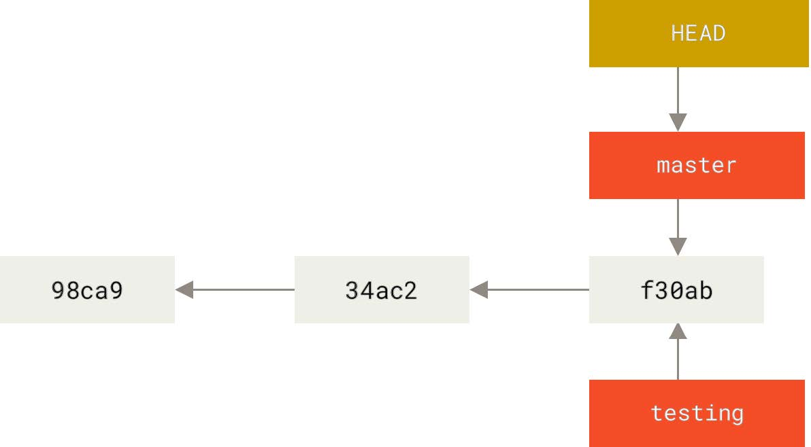

2.切换到新分支
```
git checkout -b testing
```
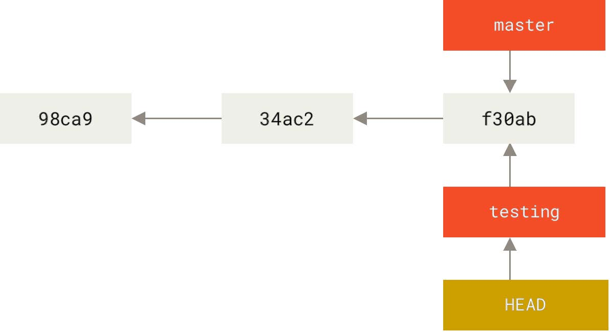

3.进行修动
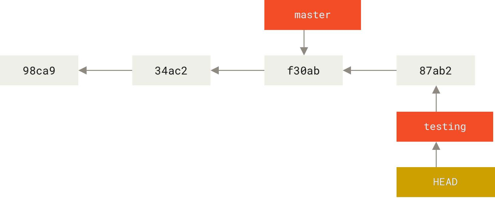

4.切换回主分支
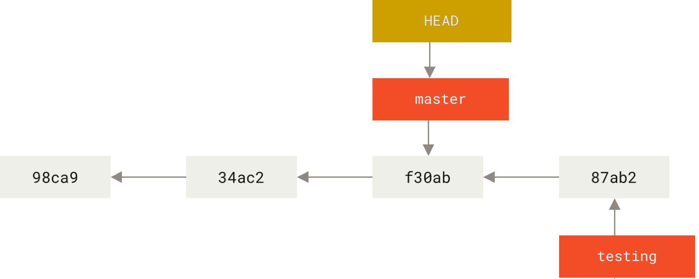

情况一：直接合并主分支与当前分支

5.合并分支
```
git merge testing
```

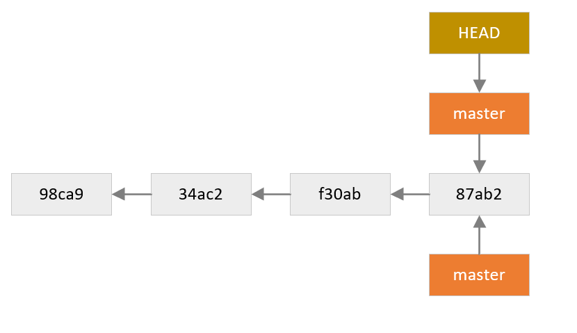

情况二：主分支继续开发，此时合并会出现冲突

6.合并分支
```
git merge testing
```


## 分支变基(rebase)

### 1.合并多个commit为一个完整commit


1.查看log日志
```
git log
```
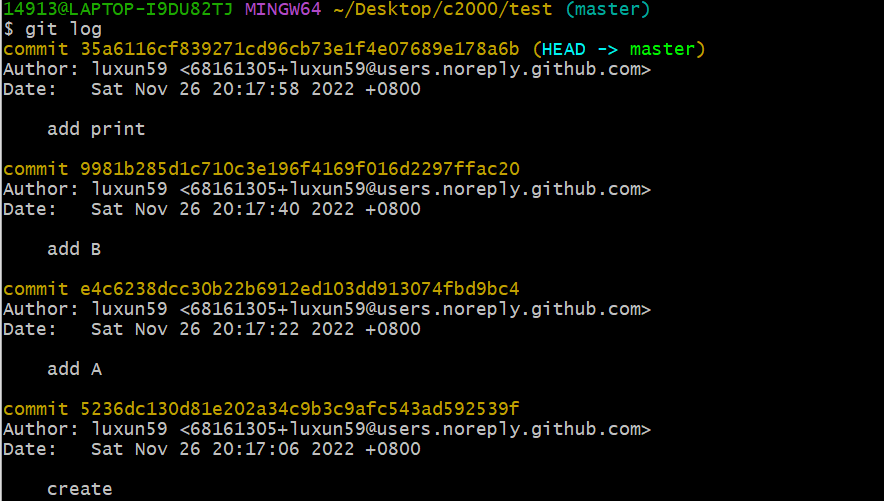

2.运行
```
 git rebase -i  [startpoint]  [endpoint]
```
``-i``的意思是--interactive，即弹出交互式的界面让用户编辑完成合并操作，[startpoint] [endpoint]则指定了一个编辑区间,此区间为前开后闭，如果不指定[endpoint]，则该区间的终点默认是当前分支HEAD所指向的commit。输入时输入四位以上地址或使用HEAD~3 格式。
如：
```git rebase -i e4c6```
或
```git rebase - i HEAD~3```

3.编辑指令(使用vim)

使用vim进行编辑，输入``:i``为插入模式，按``esc``退出插入模式，``:q``退出不保存，``:wq``保存并退出，指令见附录vim指令简介。

这里举例将合并``add print``到``add B``中，使用``squash``或简写``s``。弹出的注释中有各指令含义。
- pick：保留该commit（缩写:p）
- reword：保留该commit，但我需要修改该commit的注释（缩写:r）
- edit：保留该commit, 但我要停下来修改该提交(不仅仅修改注释)（缩写:e）
- squash：将该commit和前一个commit合并（缩写:s）
- fixup：将该commit和前一个commit合并，但我不要保留该提交的注释信息（缩写:f）
- exec：执行shell命令（缩写:x）
- drop：我要丢弃该commit（缩写:d）

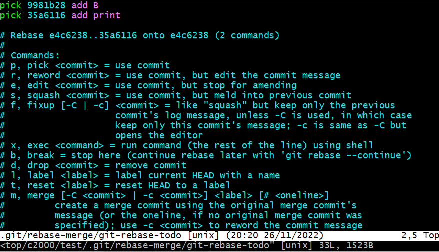

4.编辑注释（vim编辑）

在此编辑注释，保存后退出。


5.再次查看log

两次commit已经合并。

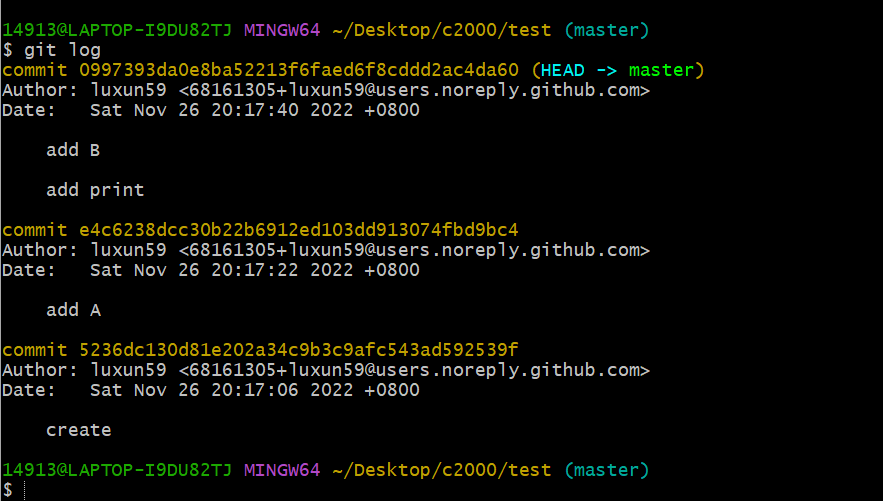

### 2.将某一段commit粘贴到另一个分支上

#### 方式一 使用临时分支，不变开发分支

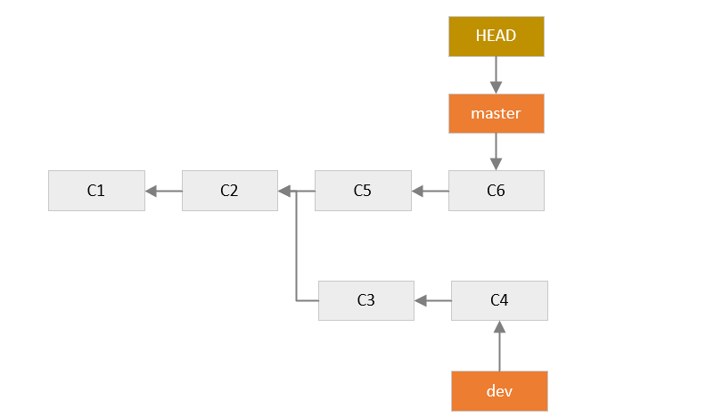
```
git rebase   [startpoint]   [endpoint]  --onto  [branchName]
```
如：
```
git  rebase   90bc0045b^   5de0da9f2   --onto master
```
但是当前HEAD会处于游离状态，实际上，此时所有分支的状态应该是这样：
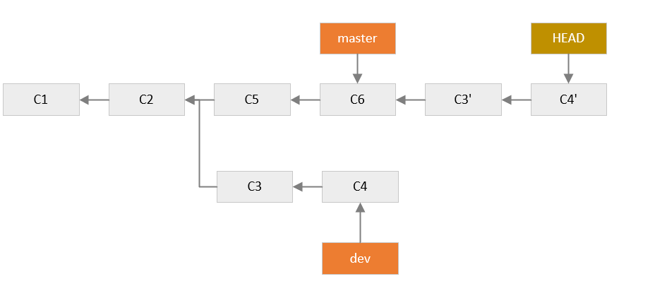

虽然此时HEAD所指向的内容正是我们所需要的，但是master分支是没有任何变化的，git只是将C~E部分的提交内容复制一份粘贴到了master所指向的提交后面，我们需要做的就是将master所指向的提交id设置为当前HEAD所指向的提交id就可以了，即:

切换分支：
```
git checkout master
```
改变master分支id：
```
git reset --hard  0c72e64
```
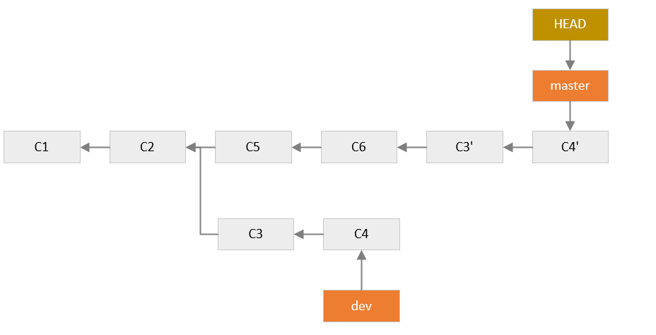


#### 方式二 变开发分支


```
git rebase --onto master dev
```
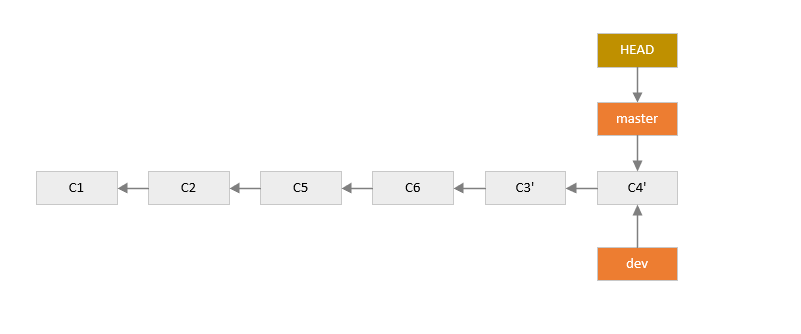


## 常见branch工作方式


### remote

在远程仓库存储，在本地仓库开发。

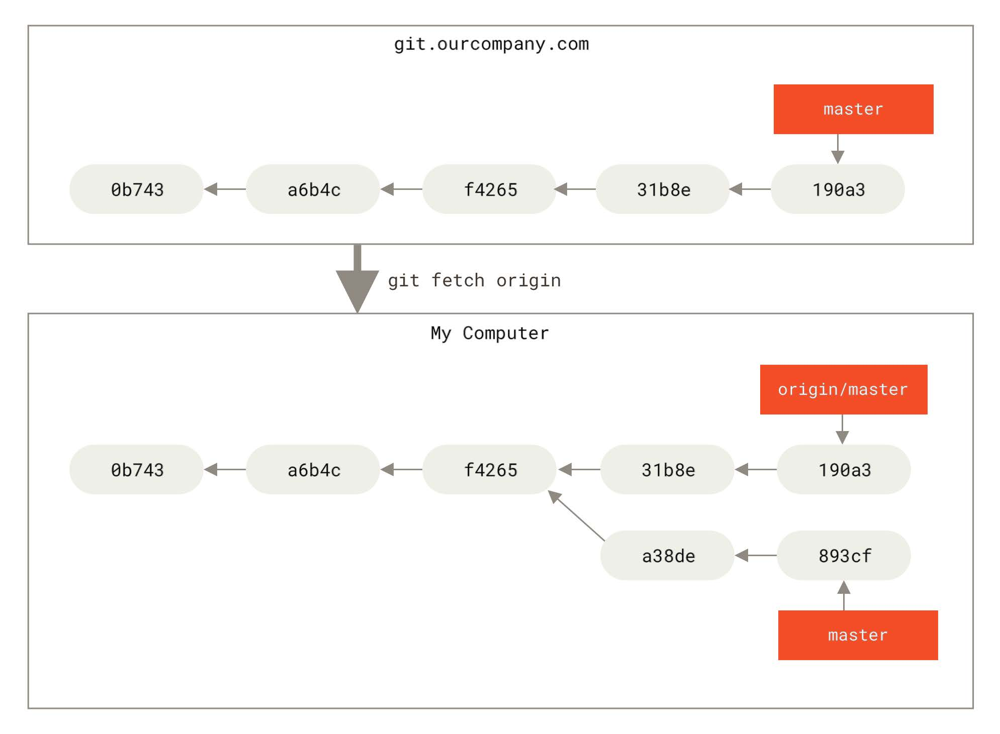


## 相关指令

### 1.branch 

格式：``git branch <-> <NAME>``

相关参数含义：

``-b`` 创建并切换，相当于branch＋checkout

``-d`` 删除分支


1.查看分支

```
git branch
```

2.创建分支

```
git branch <name>
```

3.创建并切换分支
```
git branch -b <name>
```
4.删除分支
```
git branch -d <name>
```

### 2.checkout

切换分支
```
git checkout <name>
```

### 3.merge

7.合并分支(合并指定分支到当前分支)
```
git merge
```

### 4.rebase

git rebase [--] [] [] []

参数含义:``--onto``  
```
git rebase --onto A B C
```


### 5.push

删除远程分支
```
git push origin --delete serverfix
```

### 6.pull

5.对现场进行存储

```
git stash
```


## 解决冲突

当两个分支都各自有新的提交，便会产生冲突，无法直接合并，必须手动解决。

1.使用git merge进行合并。 会提示``Merge conflict ``。此时将无法直接push。

2.打开文件，手动修改后保存。
注意：Git用``<<<<<<<``，``=======``，``>>>>>>>``标记出不同分支的内容，

3.解决冲突后重新添加、提交、合并。


