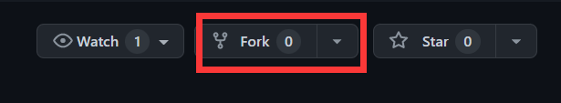

<!--
 * @Author: luxun59 luxun59@126.com
 * @Date: 2022-11-27 22:03:12
 * @LastEditors: luxun59 luxun59@126.com
 * @LastEditTime: 2022-11-27 22:29:28
 * @FilePath: \driverc:\Users\14913\Desktop\c2000\http\pullRequest.md
 * @Description: 
 * 
 * Copyright (c) 2022 by luxun59 luxun59@126.com, All Rights Reserved. 
-->
# pull Request

- [pull Request](#pull-request)
  - [Pull Request 在Fork工作流中的应用](#pull-request-在fork工作流中的应用)
    - [1.fork 项目](#1fork-项目)
    - [2.clone fork得到的仓库](#2clone-fork得到的仓库)
    - [3.创建新分支](#3创建新分支)
    - [4.编辑项目代码并commit](#4编辑项目代码并commit)
    - [5.push到fork得到的仓库](#5push到fork得到的仓库)
    - [6.创建Pull Request](#6创建pull-request)
    - [7.审查Pull Request](#7审查pull-request)

Pull Request 是一种机制，让开发者告诉项目成员一个功能已经完成。一旦 feature 分支开发完毕，
开发者使用 GitHub 账号提交一个 Pull Request。它告诉所有参与者，他们需要审查代码，并将代码并入 master 分支。


## Pull Request 在Fork工作流中的应用

A是一开发者，B是项目维护者也是项目仓库的拥有者。

A为了参与该B的项目，并须执行以下步骤。

### 1.fork 项目

A登录Github账号，找到B的仓库，然后点击``Fork``按钮。




选好目标位置,便在开发者的账户上获得了该项目仓库的副本。

### 2.clone fork得到的仓库
开发者clone在自己账户上fork得到的仓库副本。

```
git clone <remote>
```

### 3.创建新分支

在本地创建新分支，以实现开发。

```
git checkout -b feature-xxx
```

### 4.编辑项目代码并commit

在本地开发项目,并将修改``add``到暂存区并``commit``。

```
git add <name>
```

```
git commit -m "add feature xxx"
```


### 5.push到fork得到的仓库

```
git push origin feature--xx
```
注意：此处push的远程仓库是开发者自己fork官方仓库得到的仓库。

### 6.创建Pull Request


来到开发者自己``fork`` 得到的仓库，点击项目简介下的 New Pull Request 按钮，用自己的GitHub账号创建一个 Pull Request。自己fork得到的仓库会被默认设置为源仓库（head fork），填写指定源分支（compare）、目标仓库（base fork）和目标分支（base）。


### 7.审查Pull Request

维护者会审查pull request并将修改合并到官方仓库。

